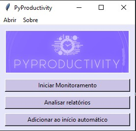
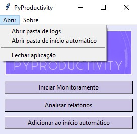
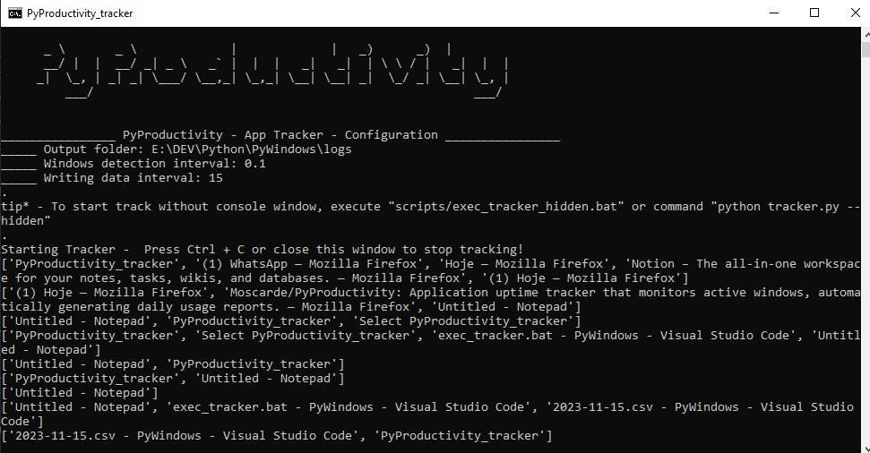
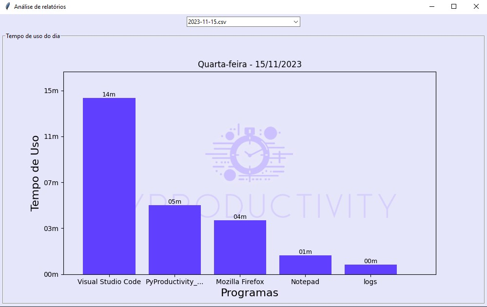
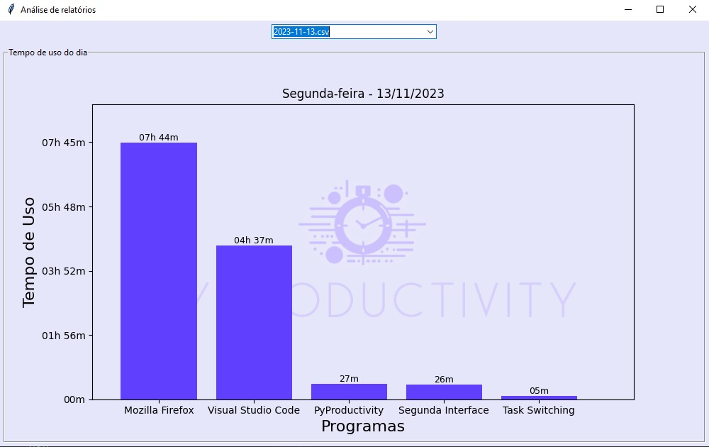

<p align="center">
    <a href="#"></a>
</p>


The script is an application uptime tracker that monitors active windows and records the time spent on specific applications, automatically generating daily usage reports. The script can help you analyze where you are wasting time and increase your productivity by focusing on the right applications.

> [Versão em Português](readme_ptbr.md)

🖥️ Main interface                                        | 🖥️ Tracker console                                        | 🖥️ Analysis Interface   
:----------:                                            | :--------------:                                        | :--------------: 
    |    |  

## ⚙️ Features

- ✅ Monitor and record the uptime of active windows
- ✅ Detect Inactivity
- ✅ Log data to csv file
- ☑️ Read date reports and plot total usage time graphs

## 🧰 Libs

- ✅ __pygetwindow__: Identifies the active window title
- ✅ __pyautogui__: Helps identify inactivity
- ✅ __matplotlib__: Plots graphs
- ✅ __pandas__: Analyses data
- ✅ __numpy__: Assists in data management
- ✅ __pywin32__: Allow hiding the console (optional)


## ⬇️ Usage

1. Clone or download the repository to your local machine.

2. Open a terminal or command prompt and navigate to the directory where the script is located.

3. Run the script using the following command:

```shell
 python main.py
```
or 

4. Execute __exec_main.bat__ file in the same directory

5. In the main interface you can chose which function you want to execute
    - Start tracking script
    - Open analysis inteface
    - Install tracking script in system startup

# 📋 Prerequisites 

Before using the PyProductivity, make sure you have the following prerequisites:

- Python 3.x installed on your system.
- The required Python libraries installed. You can install them using pip:

``` shell
pip install -r requirements.txt
```
or

- Execute __update_libs.bat__ file in the same directory

## Example csv logs and analysis interface 📊

 

```csv

timestamp,app_name,minutes_away
2023-11-03 16:08:04,Windows PowerShell,0
2023-11-03 16:08:08,Windows PowerShell,0
2023-11-03 16:08:08,tracker_data.py - PyWindows - Visual Studio Code,0
2023-11-03 16:08:08,Visual Studio Code,0

```

The report comprises the timestamp, window name of an application, and the duration of inactivity in minutes (which can be used for data analysis and filtering).


## ⌛ Development progress

- [x] Monitor and record the uptime of active windows
- [x] Detect Inactivity
- [x] Log data to csv file
- [x] Read date reports and plot total usage time graphs
- [ ] More insightful graphs
- [ ] Time goals with real-time progress visualization
- [ ] Limit app daily usage time by app name

And maybe something more


## 🙏 Special thanks

This repository readme was inspired in readme template from [repo-full-readme](https://github.com/Dener-Garcia/repo-full-readme/) by [Dener Garcia](https://github.com/Dener-Garcia)


## 💬 Lets connect?

<div align="left">
  <a href="https://linkedin.com/in/moscarde" target="_blank">
    
  </a>
  <a href="https://github.com/moscarde" target="_blank">
    
  </a>
    
  
</div>